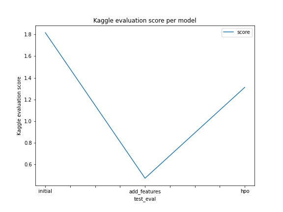

# Report: Predict Bike Sharing Demand with AutoGluon Solution
In this project, we predicted the bike sharing demand based on the features such us the date and time, the temperature, the humidity, and the windspeed.     
We worked in AWS SageMaker Studio and used AutoGluon. We experimented three models, which were submitted to Kaggle for evaluation.

> **Report date : May, 2023**     
> **Written by : [Ekoue LOGOSU-TEKO](https://www.linkedin.com/in/ekouelogosuteko/?locale=en_US)**

## Initial Training
When the predictions were submitted to kaggle, they were rejected each time they contain negative value. So we needed to check negative value, and replace them with zero.

### What was the top ranked model that performed?
The top ranked model was the first one: it was trained using the default parameters of AutoGluon and got a score of `1.8` from Kaggle.

## Exploratory data analysis and feature creation
EDA showed us the distribution of the numerical features, which allowed us to spot the skew in `windspeed, registered, casual and count`. 
Another action we did take is to engineer new features (`year, month, day, hour`) based on the feature `datetime`, in order to try improving our model results.

### How much better did your model preform after adding additional features and why do you think that is?
After having added our new features (`year, month, day, hour`) and removed the feature `datetime` (since its information is already conveyed in the engineered features), the new model kaggle score dropped to `0.47450`, againt `1.81618` when the `datetime` column was used instead of the engineered ones (let us take note of the fact that `datetime` column is of type datetime).   
So we can infer from this that AutoGluon has the hability to preprocess and engineer datetime features in different ways and select the best one, in order to allow the model to get the best  result.

## Hyper parameter tuning
After tuning the model hyper-parameters, the models performance dropped to `1.31230` against `1.81618` when we left the hyper-parameters untouched.

### If given more time with this dataset, where would we spend more time?
If given more time, I will spend more time on the first model, the baseline one (its hyper-parameters were not tuned, and `datetime` features were not engineered in the data fed to it).
That choice is based on the fact that clearly, AutoGluon is very good at predicting well on our dataset without our intervention, so we should give it more time to train (for e.g., doubling the training duration and observing the results).

### Create a table with the models we ran, the hyperparameters modified, and the kaggle score.
|model|timelimit (seconds)|presets|others|score|
|--|--|--|--|--|
|initial|10x60|best_quality|-|1.81618|
|add_features|10x60|best_quality|-|0.47450|
|hpo|12x60|best_quality|nn:activation -- dropout_prob; gmb:num_boost_round -- num_leaves; scheduler; searcher|1.31230|

### Create a line plot showing the top model score for the three (or more) training runs during the project.

### Create a line plot showing the top kaggle score for the three (or more) prediction submissions during the project.

## Summary
Three models were built:
- model 1:
  - Is the baseline model
  - Trained for 600 seconds, for a presets of best_quality
  - Evaluation r2 is 0.87772
  - Evaluation pearsonr is 0.9371
  - Kaggle score is 1.81618

- model 2: we updated the data fed to model 1
    - Feature engineering was done: from `datetime`, we created `year, month, day, hour` columns
    - Trained for 600 seconds, for a presets of best_quality
    - We set the following features to categorical type: `season, workingday, weather` 
    - Evaluation r2 0.961712
    - Evaluation pearsonr 0.980683
    - Kaggle score is 0.47450

- model 3: we updated model 1, while conserving the data originally fed to it
  - Trained for 720 seconds, for a presets of best_quality
  - Trained on more data than model 1
  - Evaluation r2 is 0.58343
  - Evaluation pearsonr is 0.772
  - Kaggle score is 1.31230